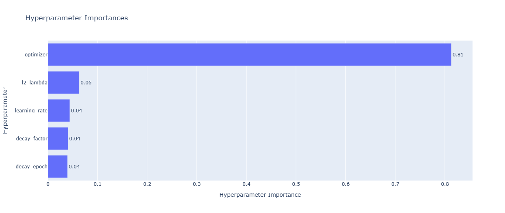
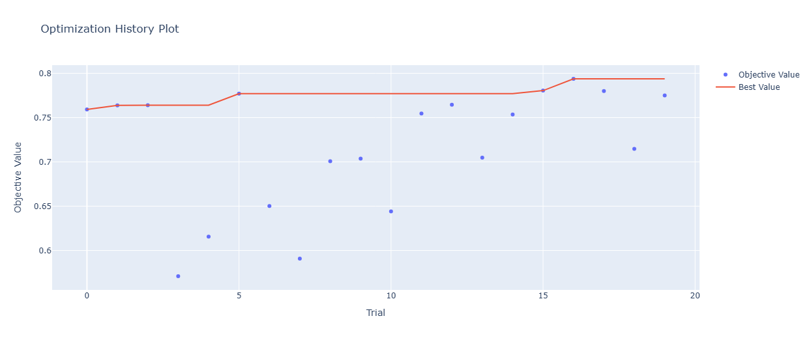
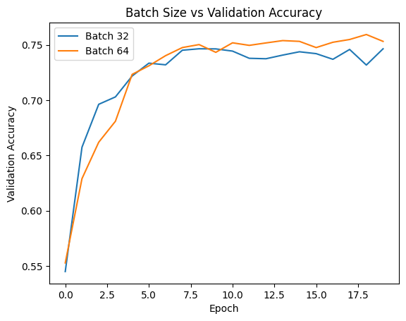
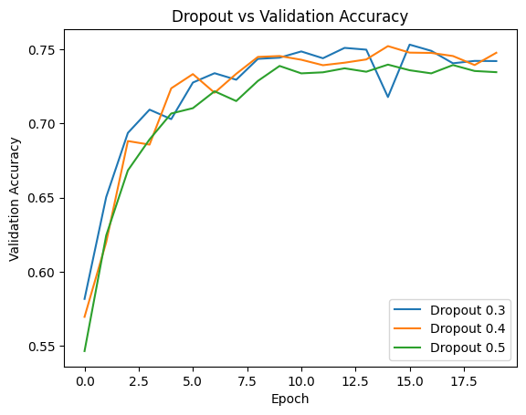
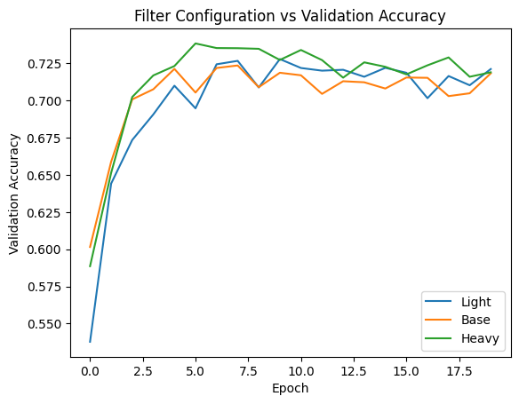
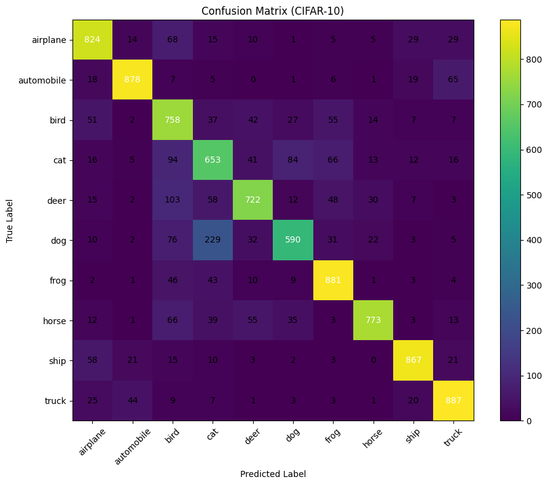

# CIFAR-10 Image Classification using CNNs and Optuna Optimization


## Project Overview

This project implements a deep learning pipeline for image classification on the CIFAR-10 dataset using Convolutional Neural Networks (CNNs). The objective was to design a robust CNN architecture, systematically optimize training parameters using Optuna, and analyze the impact of various architectural and training decisions on model performance.

Unlike a standard CIFAR-10 classifier, this project focuses on experimentation and optimization, evaluating multiple configurations of batch sizes, dropout rates, filter depths, learning rate schedules, regularization strengths, and optimizers.

The final model achieved **78.87% test accuracy** while maintaining strong generalization through regularization and automated hyperparameter optimization.

---

# Dataset

The model was trained on the CIFAR-10 benchmark dataset.

### Dataset Statistics

| Property          | Value   |
| ----------------- | ------- |
| Number of Images  | 60,000  |
| Training Images   | 50,000  |
| Test Images       | 10,000  |
| Image Resolution  | 32×32×3 |
| Number of Classes | 10      |

### Classes

* Airplane
* Automobile
* Bird
* Cat
* Deer
* Dog
* Frog
* Horse
* Ship
* Truck

---

# Project Objectives

The primary goals of this project were:

* Build an effective CNN architecture for image classification.
* Improve model generalization using regularization techniques.
* Optimize training hyperparameters using Optuna.
* Analyze the effect of architectural choices on performance.
* Study optimizer behavior and learning rate scheduling.
* Evaluate classification performance using detailed metrics and confusion matrices.

---

# Data Preprocessing

The following preprocessing steps were applied:

### Normalization

Pixel values were scaled from:

```python
0 - 255
```

to

```python
0 - 1
```

to improve gradient stability during training.

### Label Encoding

Class labels were converted into categorical format suitable for multi-class classification.

### Validation Split

A validation subset was created from the training data to monitor model performance during optimization and prevent overfitting.

---

# CNN Architecture

The network consists of multiple convolutional blocks designed for progressive feature extraction.

## Architecture Components

### Feature Extraction Layers

* Convolutional Layers
* ReLU Activations
* Batch Normalization
* Max Pooling Layers

### Regularization Layers

* Dropout
* L2 Weight Regularization

### Classification Head

* Fully Connected Dense Layers
* Softmax Output Layer

The architecture progressively learns low-level features such as edges and textures before learning higher-level semantic representations.

---

# Regularization Strategy

Several regularization techniques were employed to improve generalization.

## Batch Normalization

Applied after convolution layers to:

* Stabilize training
* Accelerate convergence
* Reduce internal covariate shift

## Dropout

Different dropout values were evaluated:

* 0.3
* 0.4
* 0.5

Dropout helped prevent co-adaptation of neurons and reduced overfitting.

## L2 Regularization

Weight decay was incorporated to penalize large weights and encourage smoother decision boundaries.

## Early Stopping

Training was terminated when validation performance stopped improving, preventing unnecessary epochs and overfitting.

---

# Optuna Optimization

To systematically identify optimal training configurations, Optuna was used for automated hyperparameter optimization.

## Search Parameters

| Parameter     | Search Space       |
| ------------- | ------------------ |
| Optimizer     | Adam, RMSprop, SGD |
| Learning Rate | Tuned              |
| L2 Lambda     | Tuned              |
| Decay Factor  | Tuned              |
| Decay Epoch   | Tuned              |

### Optimization Objective

The objective function maximized validation accuracy.

---

# Optimization Results

## Best Validation Accuracy

**79.4%**

## Final Test Accuracy

**78.87%**

### Hyperparameter Importance

<p align="center">
  
</p>

The Optuna importance analysis revealed:

| Parameter     | Importance |
| ------------- | ---------- |
| Optimizer     | 81%        |
| L2 Lambda     | 6%         |
| Learning Rate | 4%         |
| Decay Factor  | 4%         |
| Decay Epoch   | 4%         |

### Key Insight

Optimizer selection had the largest impact on model performance, accounting for more than 80% of observed variation.

---

# Optimization History

<p align="center">
  
</p>

The optimization history demonstrates steady improvement across trials, with Optuna progressively discovering more effective parameter combinations.

--

# Experimental Analysis

## Batch Size Study

<p align="center">
  
</p>

### Configurations Evaluated

* Batch Size 32
* Batch Size 64

### Findings

* Batch size 64 achieved slightly higher validation accuracy.
* Larger batches produced smoother convergence behavior.

---

## Dropout Study

<p align="center">
  
</p>

### Configurations Evaluated

* Dropout 0.3
* Dropout 0.4
* Dropout 0.5

### Findings

* Moderate dropout provided the best trade-off between regularization and learning capacity.
* Excessive dropout slightly slowed convergence.

---

## Filter Configuration Study

<p align="center">
  
</p>

### Architectures Evaluated

* Light CNN
* Base CNN
* Heavy CNN

### Findings

* Increasing filter depth improved feature extraction capability.
* Larger models achieved stronger validation performance but required greater computational resources.

---

# Model Evaluation

## Test Accuracy

| Metric        | Value  |
| ------------- | ------ |
| Test Accuracy | 78.87% |

---

## Confusion Matrix

<p align="center">
  
</p>

### Strongest Classes

The model achieved particularly strong performance on:

* Automobile
* Frog
* Ship
* Truck
* Airplane

### Challenging Classes

Most errors occurred between visually similar categories:

* Cat ↔ Dog
* Bird ↔ Deer
* Deer ↔ Horse

These confusion patterns are common in CIFAR-10 due to low image resolution and visual similarity between classes.

---

# Technologies Used

## Deep Learning

* TensorFlow
* Keras

## Hyperparameter Optimization

* Optuna

## Data Processing

* NumPy
* Pandas

## Visualization

* Matplotlib
* Seaborn

## Evaluation

* Scikit-learn

---

# Repository Structure

```text
├── optuna_plots
    ├── contour_plot.png
    ├── hyperparameter_importance_plot.png
    ├── optimization_history_plot.png
    ├── parallel_coordinate_plot.png
    ├── slice_plot.png
├── results
    ├── batch_size-accuracy-plot.png
    ├── oconfusion_matrix.png
    ├── dropout-accuracy-plot.png
    ├── filter-accuracy_plot.png
    ├── loss-accuracy_curve.png
    └── model_architecture.png
   └── optuna_results.png
└── README.md
└── project_architecture.png
└── requirements.txt
└── training_notebook.ipynb

   
```

---

# Key Achievements

 Built a CNN-based image classification system for CIFAR-10

 Applied Batch Normalization, Dropout, and L2 Regularization

 Automated model optimization using Optuna

 Conducted extensive architectural and training experiments

 Achieved 78.87% test accuracy on CIFAR-10

 Performed detailed performance analysis using confusion matrices and optimization visualizations

---

# Future Improvements

* Data Augmentation Pipeline
* Transfer Learning using ResNet/EfficientNet
* Mixed Precision Training
* Knowledge Distillation
* Ensemble Models
* Streamlit Deployment
* MLflow Experiment Tracking

---

# Conclusion

This project demonstrates a complete deep learning workflow, from dataset preprocessing and CNN architecture design to Optuna-driven optimization and model evaluation. Through systematic experimentation and automated hyperparameter search, the model achieved strong classification performance while providing valuable insights into the factors that most influence CNN effectiveness on CIFAR-10.

# Author

Siddharth Jain
